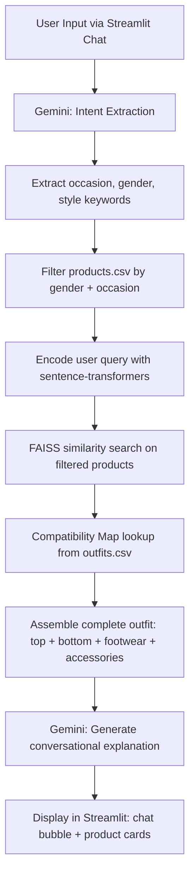

# Architecture

The full pipeline from user input to outfit display:

## Module map

| File | Responsibility |
|------|----------------|
| `app.py` | Streamlit UI, sidebar profile, chat loop, session state |
| `src/utils.py` | CSV loaders, small formatting helpers |
| `src/embeddings.py` | sentence-transformer model + FAISS flat index |
| `src/compatibility.py` | Build the hero→outfit map from `outfits.csv` |
| `src/llm.py` | Gemini wrapper (intent extraction + explanation generation) |
| `src/recommender.py` | Orchestration: filter → search → match → assemble |

## Why these choices

- **Flat FAISS index, not IVF/HNSW** — only 68 vectors, so brute-force is instant and accurate.
- **Text embeddings, not CLIP** — the metadata in `products.csv` is rich (name + tags + description) and CLIP would add ~600 MB of dependencies for marginal gain on this catalog size.
- **Outfit graph, not a learned compatibility model** — we already have 25 stylist-curated outfits in `outfits.csv`. Using them directly is more reliable than training a model on this little data.
- **LangChain only for memory** — full chains/agents would be overkill; `ConversationBufferMemory` is enough and shows familiarity for the interview.
